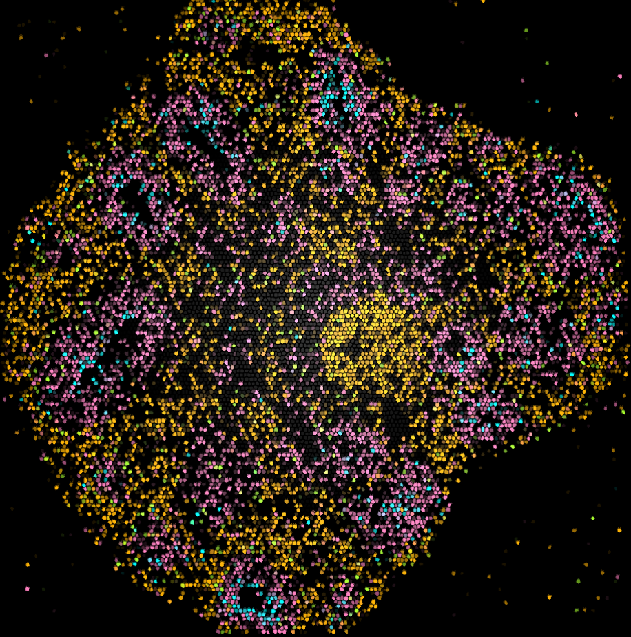

<link href="https://cdn.jsdelivr.net/npm/bootstrap@5.0.0-beta3/dist/css/bootstrap.min.css" rel="stylesheet" integrity="sha384-eOJMYsd53ii+scO/bJGFsiCZc+5NDVN2yr8+0RDqr0Ql0h+rP48ckxlpbzKgwra6" crossorigin="anonymous">

<link rel="stylesheet" type="text/css" href="css/main.css">

  

    

      
    

    

            
      

        We develop and apply nucleic acid-based technologies to investigate the human brain in healthy and diseased states, so as to identify therapeutic portals for improving mental well-being.
      

    

  

